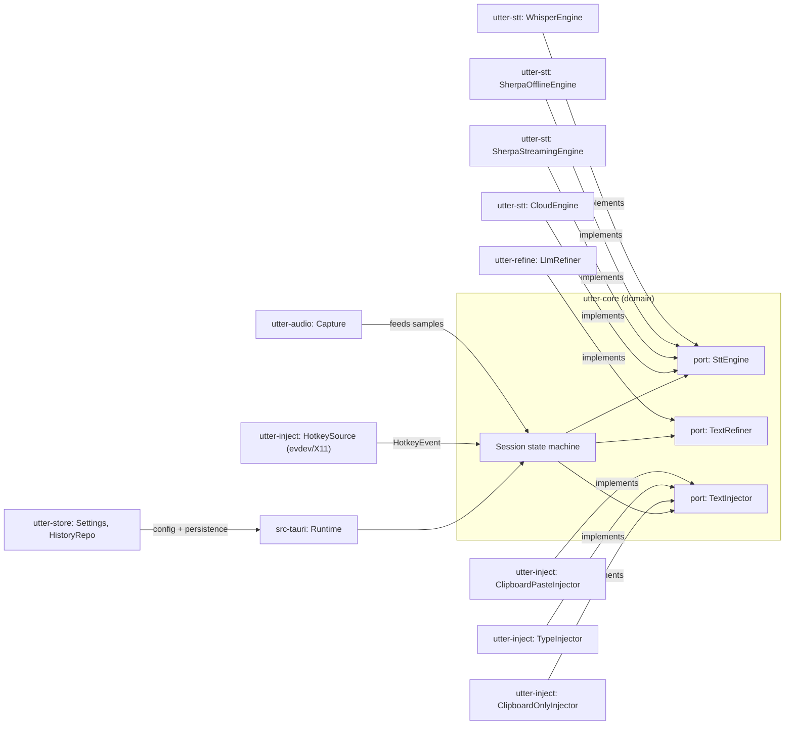
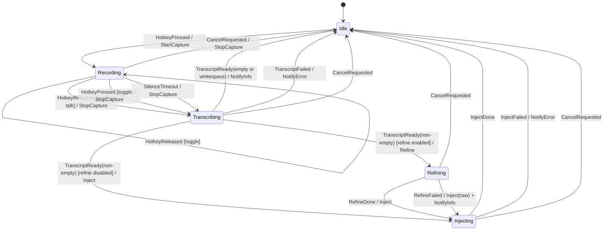

# Architecture

Utter is a Cargo workspace organized around a hexagonal (ports & adapters)
core: `utter-core` defines the domain — a pure session state machine and the
trait boundaries every other crate implements or calls — and depends on
nothing platform-, network-, or UI-specific. Everything else is an adapter
plugged in at the edge.

## Workspace map

| Crate | Responsibility |
|---|---|
| `utter-core` | Domain: the `Session` state machine, ports (`SttEngine`, `TextRefiner`, `TextInjector`), and shared types (`Transcript`, `Tone`, `InjectionMethod`). No I/O. |
| `utter-audio` | Microphone capture via `cpal`, resampling to 16 kHz mono `i16` (`rubato`), RMS level and silence detection. |
| `utter-stt` | Speech-to-text adapters behind Cargo features: `whisper` (whisper.cpp via `whisper-rs`), `sherpa` (two sherpa-onnx adapters over the `sherpa-onnx` crate — `SherpaOfflineEngine` on the offline recognizer, serving GigaAM-v3 for Russian and Parakeet TDT 110M for English, and `SherpaStreamingEngine` on the online recognizer, serving the small Zipformer preview models for the same two languages — all four on one native runtime), `cloud` (any OpenAI-compatible `/audio/transcriptions` endpoint). |
| `utter-refine` | Transcript post-processing: dictionary replacement rules, snippet matching, prompt construction, and the LLM client (any OpenAI-compatible `/chat/completions` endpoint). |
| `utter-inject` | Global hotkey capture (evdev, with an X11 `global-hotkey` fallback) and text injection backends (clipboard-paste, direct typing, clipboard-only), chained with automatic fallback. |
| `utter-store` | TOML settings persistence, the SQLite-backed history repository, and the STT model catalog/downloader. |
| `apps/desktop/src-tauri` | Tauri 2 shell: boots the runtime from settings, wires adapters together on a worker thread, exposes commands/events to the UI, tray, and windows. |
| `apps/desktop/ui` | Svelte 5 + TypeScript settings UI and HUD: onboarding, language profiles, engine/model management, dictionary, snippets, history. |

## Ports and adapters

## Session state machine

`Session::handle` (in `crates/utter-core/src/session.rs`) is a pure,
synchronous `fn(Event) -> Vec<Effect>`: it owns no I/O and is exhaustively
unit-tested. The diagram below reflects its transition table exactly;
event/effect pairs not shown are no-ops (state unchanged, no effects) —
notably, a `HotkeyPressed` while `Transcribing`, `Refining`, or `Injecting`
is ignored, since a new session cannot start until the current one reaches
`Idle`.

A streaming engine can additionally surface partial transcripts while in
`Recording` through `SttEngine::feed`'s `Option<String>` return, handled
outside the state machine by the runtime orchestrator
(`apps/desktop/src-tauri/src/runtime.rs`), which forwards them straight to
the HUD without affecting `Session`'s state. `SherpaStreamingEngine` is what
uses that seam, as a profile's optional *draft* engine — the live preview.
The engines that produce the injected text do not: whisper.cpp, the offline
sherpa-onnx models and the cloud endpoint are all batch, producing text only
at `finish()`, so a profile with no preview model configured shows no partial
at all. Either way the seam is invisible to `Session`, which never sees a
partial and has no state for one.

## Data flow

1. **Hotkey** — the evdev (or X11 fallback) `HotkeySource` runs on its own
   thread watching every language profile's chord at once, and sends a
   `HotkeyEvent::Pressed` / `Released` carrying that chord's `BindingId` over
   a channel the runtime worker selects on. The worker resolves the id
   through `ProfileRegistry`, which builds a profile's engine and refiner the
   first time its binding is actually pressed rather than at boot, and
   isolates that load's failure to the one profile — see "One chord per
   language, engines built lazily and isolated" below.
2. **Capture** — `Session::handle` turns a press into `Effect::StartCapture`;
   the runtime starts `utter-audio`'s `Capture`, which pulls frames from
   `cpal` and resamples them to 16 kHz mono `i16`.
3. **Engine feed** — each audio frame captured while the session is
   `Recording` is fed to the active profile's `SttEngine`, which buffers it
   until `finish()`. If the profile also has a draft engine, the same frame
   goes to that too, in the same function, and the partial it decodes on the
   spot is what the HUD previews. The draft engine gets exactly one
   onnxruntime inference thread rather than the half-the-cores share the
   final engine takes: the two decode concurrently on the same machine, and
   the preview is a courtesy the injected text must not pay for. The fan-out
   lives at exactly one call site and ends when recording does — see "The
   draft engine never touches the result" below.
4. **Finish** — releasing the hotkey (or a silence timeout) stops capture,
   drains the frames still in flight into the final engine alone, and calls
   `engine.finish()`, producing a `Transcript`. The draft engine's `finish()`
   is never called.
5. **Rules and snippets** — the runtime applies dictionary replacement rules
   to the raw transcript, then checks it against configured snippets. A
   snippet match replaces the text outright and skips the refiner
   entirely, regardless of the refine setting.
6. **Refine** — if refinement is enabled and no snippet matched,
   `Effect::Refine` calls the configured `TextRefiner` (`LlmRefiner`, backed
   by any OpenAI-compatible `/chat/completions` endpoint) with a bounded
   timeout. A failure or timeout falls back to the raw transcript and
   surfaces a non-blocking notice — the dictation is never lost.
7. **Inject** — the resulting text goes to the injector chain: clipboard-paste
   first, then direct typing, then clipboard-only, stopping at whichever
   succeeds.
8. **History** — on success, the runtime records the raw and final text,
   duration, engine, target app (best-effort), and which profile produced
   the entry in the SQLite history database (skipped entirely if history is
   disabled in settings). Audio itself is discarded once transcription
   finishes; it is never written to disk at any step above.

## Key decisions

- **One chord per language, engines built lazily and isolated from each
  other's failures** — a language profile binds a hotkey chord to an engine,
  model and refinement policy as one unit, so pressing the chord for Russian
  or English selects everything that follows from that language with no
  separate engine choice. `ProfileRegistry` (`apps/desktop/src-tauri/src/profiles.rs`)
  warms the primary profile at app boot and builds every additional profile's
  engine and refiner only when its hotkey is first pressed. A global idle timeout can later drop the
  profile's final engine, preview engine and refiner as one unit; active
  dictation is excluded, and the next press follows the same lazy-load path.
  Lazy loading matters because the models a profile can select
  together weigh about a gigabyte, the app sits in the tray all day, and most
  sessions only ever speak one language — loading every configured profile's
  engine at boot would make a bilingual setup cost more idle memory than a
  monolingual one, even for someone who never presses the second hotkey.
  Isolation matters because, before profiles, there was exactly one engine:
  if it failed to load, dictation simply didn't work, and that was the whole
  story. With more than one profile, a broken model for one language must
  not take a healthy one down with it — a missing or damaged model for
  Russian degrades to a per-profile notice on the Russian binding alone; the
  English binding loads and works normally.
- **evdev hotkeys over a desktop-portal API** — Wayland has no standard
  global-hotkey protocol, and hold-to-record needs modifier-only chords
  (e.g. `Ctrl+Super`) that compositor shortcut APIs generally don't expose.
  Reading `/dev/input` directly works uniformly across compositors, at the
  cost of needing `input` group / uinput permissions — which onboarding
  detects and offers a one-line fix for.
- **Clipboard-paste as the default injection method** — it's the fastest
  path that works reliably across GTK, Qt, Electron, and terminal apps
  alike, at the cost of touching the system clipboard (mitigated by saving
  and restoring its previous contents around the paste). The paste
  keystroke itself is synthesized through Utter's own `/dev/uinput` virtual
  keyboard device on both X11 and Wayland (no `ydotool` daemon required) —
  the same mechanism that lets synthetic input reach an arbitrary focused
  window under Wayland compositors also covers X11, so there is no separate
  XTEST path. The X11-specific code in `utter-inject` (`hotkey_x11`) is a
  hotkey-*listening* fallback only, not part of injection. Direct typing and
  clipboard-only are kept as fallbacks for the apps where paste is
  unreliable or clipboard access is undesirable.
- **Blocking `reqwest` on dedicated worker threads, no async runtime in the
  domain** — `utter-core` stays synchronous and deterministic (a pure state
  machine is easy to test exhaustively; an async one is not), so network
  calls (cloud STT, LLM refinement) use `reqwest`'s blocking client from the
  runtime's own worker thread rather than pulling `tokio` into the domain
  or adapter crates.
- **One sherpa-onnx adapter for two languages, not two engines** —
  `SherpaOfflineEngine` doesn't know or care whether the directory it was
  given holds GigaAM-v3 or Parakeet TDT 110M: both are NeMo transducer
  exports with the same encoder/decoder/joiner/tokens layout (only the
  encoder filename differs — `encoder.int8.onnx` vs `encoder.onnx` — which
  `load()` resolves by trying both). `SherpaStreamingEngine` is split from it
  along a different axis — sherpa-onnx's online recognizer is a separate API,
  not a mode of the offline one — and is itself language-agnostic the same
  way, serving both Zipformer preview models. Three engines a profile can
  pick (`whisper`, `sherpa`, `cloud`) plus the optional preview are therefore
  backed by two native runtimes — whisper.cpp and onnxruntime via
  sherpa-onnx, both linked statically — with the onnxruntime one covering
  every language role instead of one runtime per language.
- **One trait for both batch and streaming engines** — `SttEngine::feed`
  returns `Option<String>` rather than `()` so a batch engine (whisper.cpp,
  the offline sherpa-onnx models, cloud — all of which only produce a result
  at `finish()`) and a streaming one can share one trait, without forcing a
  batch engine to fake partial output or a streaming one to discard its main
  advantage. `SherpaStreamingEngine` is the first implementation to return
  `Some` from `feed`, and it needed no change to the port to do it: the
  runtime holds a profile's draft engine in the same `Box<dyn SttEngine>` as
  its final one, and the fan-out in the worker is two calls on the same
  trait rather than a second abstraction.
- **The draft engine never touches the result, and that is structural** —
  the live preview's text must never reach the injected transcript or the
  history. That guarantee is not maintained by care or asserted by a test;
  it holds because no draft transcript is ever produced. `begin()` and
  `feed()` are the only calls made on a draft engine anywhere in the
  codebase — `finish()`, the one call that would return a `Transcript`, is
  deliberately absent — so there is nothing on any path that could be
  mistaken for the real one. `feed_draft`'s return value is consumed one
  line later by `handle_partial`, the single function that talks to the HUD.
  A test can only show that the leak did not happen in the cases it
  enumerates; not producing the value at all means there is no case to
  enumerate. The same shape decides the trailing frames drained after the
  hotkey is released: they go to the final engine only, because the user is
  already waiting on that decode and nothing would ever read a draft one.
- **A model's kind is checked against the catalog before its files are
  opened** — sherpa-onnx's C++ layer calls `_Exit()` when handed a model it
  cannot read: it does not return an error, it takes the whole process down,
  and no Rust code can catch that. An offline model and a streaming one
  install under the *same* four artifact names
  (`encoder.onnx`/`decoder.onnx`/`joiner.onnx`/`tokens.txt`), so a perfectly
  intact offline model handed to the streaming recognizer looks right until
  the moment it is fatal. `runtime_boot`'s `wrong_model_kind` therefore
  settles the question on catalog data alone — `ModelManager::engine_of`,
  no filesystem — before anything else runs, on both the streaming and the
  batch load path. This is distinct from the artifact size verification
  introduced in v0.2 and deliberately runs before it: that check answers
  "are these files intact" and guards against a truncated download, which is
  the other way to reach the same `_Exit()`. Neither check subsumes the
  other, because a model of the wrong kind is usually perfectly intact.
- **TOML settings, SQLite history** — settings are small, human-editable,
  and benefit from being diffable and hand-fixable (TOML); history is an
  append-heavy, queryable log where a real database (SQLite via `rusqlite`,
  bundled — no system dependency) is a better fit than a flat file.
- **Degradation over failure** — a missing model, an unset refine API key,
  an invalid hotkey, a preview model that cannot be loaded or that fails
  mid-utterance, or a build without the `sherpa` feature all boot the app
  anyway, with the affected feature reporting an error only when actually
  used (or an upfront notice), rather than the whole app refusing to start.
  Runtime boot (`apps/desktop/src-tauri/src/runtime_boot.rs`) formalizes
  this as its explicit policy. The preview is the mildest case on that scale
  and is reported as such: it costs no word of anyone's transcript, so it
  degrades to a dark preview and an `info` notice rather than the `warning`
  a broken final engine earns.
- **Persistent logs are bounded and redacted** — the desktop shell writes
  `tracing` events through a redacting writer into four rotating local files
  rather than depending on an invisible GUI stderr stream. Credential-like
  fields, URL queries and the user's home prefix are removed before disk I/O;
  failure to create the directory falls back to stderr without aborting boot.
- **Diagnostic reports use an allowlist, not a settings dump** — the copied
  JSON is assembled from version/platform data, compiled Metal support,
  engine/model IDs, safe permission states and at most 200 redacted log lines.
  Profile names, prompts, dictionary terms, provider endpoints, reset commands
  and all other settings have no serialization path into the report.
- **Auto-update is a release-only adapter** — ordinary builds omit the Cargo
  `updater` feature. Tagged macOS builds embed a public verification key while
  the matching private key remains in the protected GitHub environment. The
  desktop shell serializes check/install operations and delegates signature
  verification and atomic replacement to Tauri's official updater plugin.
